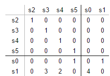
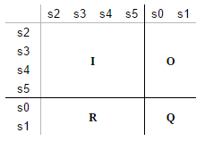
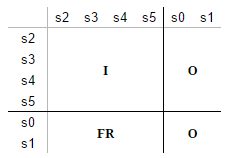
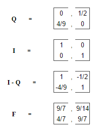
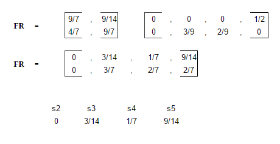

# doomsday_fuel
### The challenge specification
Making fuel for the LAMBCHOP's reactor core is a tricky process because of the exotic matter involved. It starts as raw ore, then during processing, begins randomly changing between forms, eventually reaching a stable form. There may be multiple stable forms that a sample could ultimately reach, not all of which are useful as fuel.

Commander Lambda has tasked you to help the scientists increase fuel creation efficiency by predicting the end state of a given ore sample. You have carefully studied the different structures that the ore can take and which transitions it undergoes. It appears that, while random, the probability of each structure transforming is fixed. That is, each time the ore is in 1 state, it has the same probabilities of entering the next state (which might be the same state).  You have recorded the observed transitions in a matrix. The others in the lab have hypothesized more exotic forms that the ore can become, but you haven't seen all of them.

Write a function answer(m) that takes an array of array of nonnegative ints representing how many times that state has gone to the next state and return an array of ints for each terminal state giving the exact probabilities of each terminal state, represented as the numerator for each state, then the denominator for all of them at the end and in simplest form. The matrix is at most 10 by 10. It is guaranteed that no matter which state the ore is in, there is a path from that state to a terminal state. That is, the processing will always eventually end in a stable state. The ore starts in state 0. The denominator will fit within a signed 32-bit integer during the calculation, as long as the fraction is simplified regularly.

For example, consider the matrix m:
```
[
  [0,1,0,0,0,1],  # s0, the initial state, goes to s1 and s5 with equal probability
  [4,0,0,3,2,0],  # s1 can become s0, s3, or s4, but with different probabilities
  [0,0,0,0,0,0],  # s2 is terminal, and unreachable (never observed in practice)
  [0,0,0,0,0,0],  # s3 is terminal
  [0,0,0,0,0,0],  # s4 is terminal
  [0,0,0,0,0,0],  # s5 is terminal
]
```
So, we can consider different paths to terminal states, such as:
```
s0 -> s1 -> s3
s0 -> s1 -> s0 -> s1 -> s0 -> s1 -> s4
s0 -> s1 -> s0 -> s5
```
Tracing the probabilities of each, we find that:
```
s2 has probability 0
s3 has probability 3/14
s4 has probability 1/7
s5 has probability 9/14
```
So, putting that together, and making a common denominator, gives an answer in the form of
`[s2.numerator, s3.numerator, s4.numerator, s5.numerator, denominator]` which is:
`[0, 3, 2, 9, 14]`.

#### Test cases

Inputs:
`
(int) m = [[0, 2, 1, 0, 0], [0, 0, 0, 3, 4], [0, 0, 0, 0, 0], [0, 0, 0, 0, 0], [0, 0, 0, 0, 0]]
`

Output:
`
(int list) [7, 6, 8, 21]
`

Inputs:
`
(int) m = [[0, 1, 0, 0, 0, 1], [4, 0, 0, 3, 2, 0], [0, 0, 0, 0, 0, 0], [0, 0, 0, 0, 0, 0], [0, 0, 0, 0, 0, 0], [0, 0, 0, 0, 0, 0]]
`

Output:
`
(int list) [0, 3, 2, 9, 14]
`

### Understanding

This challenge may take a couple of read throughs to understand what is actually going on and what is asked of us. Simply put the aim of your program is to output the chances of ending up in a terminal state from starting at state `s0`. Adding up the numbers in a given `int[]` provides us with a denominator which we can then start to create the probability of which state the 'ore' will change into next.

This is what is happening in a visual diagram using the example used in the specification:


From this diagram we can see that;

* `s0` has a 50% chance to go to `s5` which is a terminal state, and a 50% chance to go to `s1` which is a non-terminal state.
* `s1` has a 44.44% chance to return back to `s0`, a 22.22% chance to go to `s4` which is a terminal state, and then a 33.33% chance to go to `s3` which is another terminal state.
* `s2`, `s3`, `s4` and `s5` are terminal states, states which cannot travel to any other node. You can imagine that they have a 100% chance of remaining in the same state after an evolution.

So starting from `s0` what are the probabilities that we will end up the terminal states? It is a bit tricky to say because of the loop with 's0' and 's1' meaning that the 50% chance `s0` -> `s1` will be effected by this and so will the probabilities of `s1` -> terminal states.

What would be ideal would be just have to chances of reaching terminal nodes and removing all loops.

Well there is a way, and the way I used was a [Markov Absorbing Chain method which is a Markov chain in which _every_ state will eventually reach an absorbing state.](https://en.wikipedia.org/wiki/Absorbing_Markov_chain)

### A Solution
[Here is a good video explaining Absorbing Markov Chains.](https://www.youtube.com/watch?v=bTeKu7WdbT8) I highly recommend you watch ep 7-9 and you will _fly by_ with this challenge.

I will not go into detail about how Markov chains work as there are plenty of other online sources out there that would do a lot better than what I could do. But let us go through applying the algorithm to the example above which will give you a good insight on how you could maybe apply the same algorithm to your Java or Python solution.

First let us order the matrix so we get a better idea of what we are working with.



You can see that I have added a 100% chance that the __terminal states will transform into itself in the next evolution__.

You may have noticed that we now have an Identity Matrix and a Zero matrix, and left with two sub matrix - one represents the probabilities of a non-terminal -> terminal and for a non-terminal -> non-terminal.



* `I` - Identity Matrix
* `O` - Zero Matrix
* `R` - Sub Matrix
* `Q` - Sub Matrix

We want to approach a limiting matrix which will give us the answers we are looking for, to do this we need to calculate `FR` and `F = (I-Q)^-1` which will leave us with this matrix, and `FR` will contain the probabilities we need. (Basically we want to get rid of this non-terminal -> non-terminal matrix so we can get the probabilities of only non-terminal -> terminal)



Let us calculate `F = (I-Q)^-1` =




(Remember to get F we need to inverse the result of I-Q)

Finally `FR` =



You can see in the first row of `FR` we find the probabilities of reaching terminal states which nicely matches the order of the matrix we made, which the terminal states are at the top. You can then find your own way to find the common denominator and return the array `[0, 3, 2, 9, 14]`. You can verify you have done this correctly easily as the first row will always equal to 1.

### Summary

In summary the steps for this solution is:

* Order the matrix so that rows start with terminal states first. Remember to sort the columns correctly too to reflect this so everything matches up.

* Now that you have done that you know how to find `R` and `Q`.

* Calculate `F=(I-Q)⁻¹`.

* Calculate `FR`.

* Get the first line of `FR` and then you have your probabilities.

* Find the common denominator and return the int array how the specification has asked it to be formatted.

Some tips:

* Find the terminal states in order of ASC state number as you will have to return the probabilities in ASC state order.

* Store everything as fractions, and always simplify when possible - worry about optimizing later if you really care.

* Again; [patrickJMT's video series on Markov Chains is great and I advise that you watch episodes 7-9](https://www.youtube.com/watch?v=bTeKu7WdbT8)

In conclusion I am unsure of any other methods on how to complete this challenge, and I leave it to you on how you will go about implementing this. This method works fairly well and you shouldn't worry to much about optimization as you will be working with a maximum of 10 by 10 matrices. I wish you the best of luck if you get this challenge and I hope this helped.
