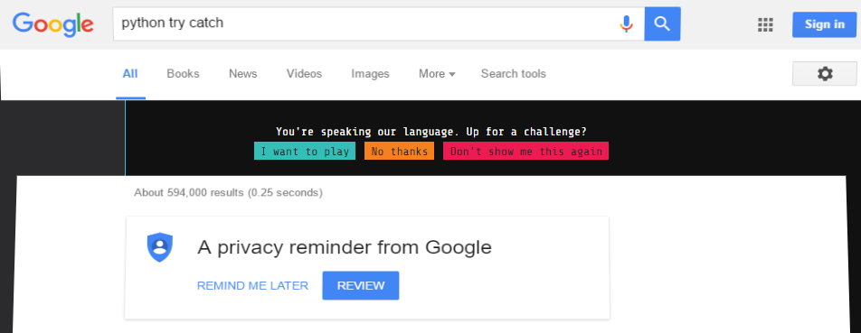

# Google foobar Help
This repository was created with the aim to help with Google Foobar challenges.

The intention here is to elaborate the challenges but not give fully coded solutions.

## What is Google's foobar
Google's Foobar is a coding challenge that consists of 5 levels and 9 questions which increase in difficulty.
 
These challenges can be completed in either Python or Java, each challenge is usually solved with a specific algorithm so a decent understanding of data structures and algorithms are recommended. 

After completing level 3 you will be prompted with the option to share you details with a Google recruiter, which may lead up to a follow up email or phone call depending on how well you tackled the challenges.

## How do I get in?
You have to be invited to participate in the challenge. One way to get an invite is to search coding related search terms like `python try catch` on Google and you may randomly see something like this:

## Challenges
Below are a list of challenge currently documented in this repository, please feel free to contribute!

The challenges can be completed in several ways, some better than others.

* [bomb_baby](./challenges/bomb_baby/bomb_baby.md)
* [doomsday_fuel](./challenges/doomsday_fuel/doomsday_fuel.md)
* [prepare_the_bunnies_escape](./challenges/prepare_the_bunnies_escape/prepare_the_bunnies_escape.md)
* [en_route_salute](./challenges/en_route_salute/en_route_salute.md)
* [ion_flux_relabeling](./challenges/ion_flux_relabeling/ion_flux_relabeling.md)
